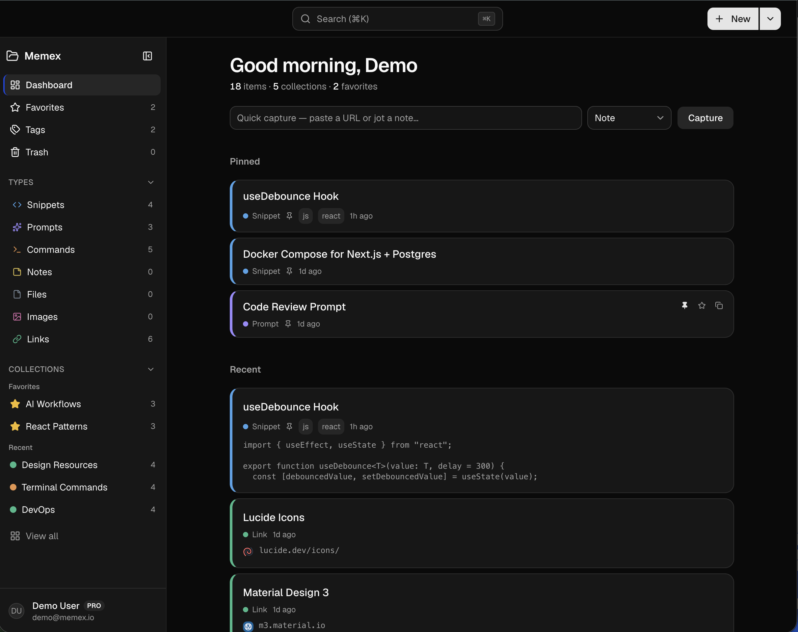
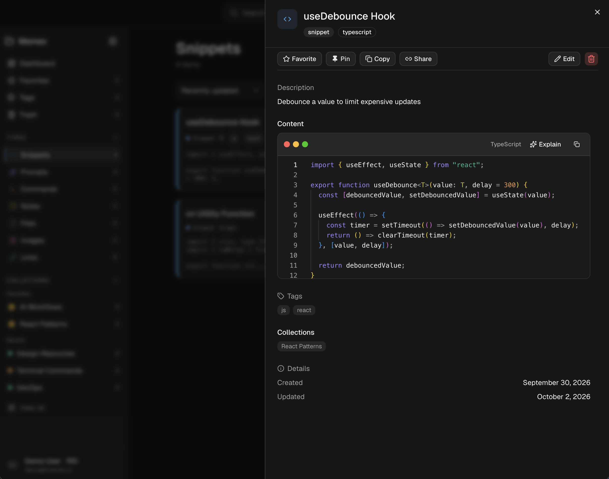

# Memex

**Store smarter. Build faster.**

Memex is an open-source developer knowledge hub: one searchable place for snippets, AI prompts, shell commands, notes, links, and files. Organize everything in collections, pin favorites, and pull it back instantly from the dashboard or the command palette.

If your essentials live in VS Code scraps, chat history, bookmarks, and random markdown files, Memex is meant to be the single source of truth—with optional AI assistance and a Pro tier for power users.

## Features

### Knowledge workspace

- **Item types** — Built-in types: snippet, prompt, command, note, file, image, and link. Pro users can define **custom item types** (up to 20).
- **Collections** — Group mixed item types (e.g. “React patterns”, “DevOps runbooks”).
- **Tags** — Case-insensitive tagging with de-duplication.
- **Favorites & pins** — Star items and collections; pin items on the dashboard.
- **Trash** — Soft-delete with restore; items auto-purge after 30 days (see [Scheduled jobs](#scheduled-jobs)).
- **Import / export** — Bring data in via the app; export your library (Pro-gated where applicable).

### Find & create quickly

- **Full-text search** — PostgreSQL-backed search across titles and content, with `type:` and `tag:` / `#` filters in the command palette (`⌘/Ctrl+K`).
- **Keyboard shortcuts** — Global shortcuts for navigation, create, and help (`?`).
- **Quick capture** — Paste a URL on the dashboard to create a link in one step.
- **Monaco & Markdown** — Code-oriented editing with syntax highlighting; markdown for notes and prompts.

### Auth & account

- **Sign-in** — Email + password and GitHub OAuth ([NextAuth](https://authjs.dev/) v5).
- **Email verification** — Optional flow via [Resend](https://resend.com/) (can be skipped in development).
- **Profile & settings** — Editor preferences, link favicons, API keys, and shared links.

### Pro capabilities

| | Free | Pro |
| --- | --- | --- |
| Items | 50 | Unlimited |
| Collections | 3 | Unlimited |
| File & image items | — | Yes (Cloudflare R2, 1 GB quota) |
| AI tools | — | Auto-tag, summarize, explain code, optimize prompts |
| REST API | — | Personal API keys (`/api/v1`) |
| Share links | — | Read-only public links (`/s/[token]`) |

Billing is implemented with **Stripe** (checkout, customer portal, webhooks). Free-tier limits are enforced in the database with transactional checks.

### AI (Pro)

Powered by **Google Gemini** (`GEMINI_API_KEY`). Features include suggested tags, summaries, code explanation, and prompt optimization, with rate limiting via Upstash Redis in production.

## Tech stack

| Layer | Choice |
| --- | --- |
| Framework | [Next.js 16](https://nextjs.org/) (App Router, React 19) |
| Language | TypeScript (strict) |
| Database | PostgreSQL ([Neon](https://neon.tech/) or any Postgres) + [Prisma](https://www.prisma.io/) |
| Auth | NextAuth v5 |
| Storage | Cloudflare R2 (S3-compatible) |
| Payments | Stripe |
| UI | Tailwind CSS v4, [shadcn/ui](https://ui.shadcn.com/), Lucide icons |
| Tests | Vitest |

Architecture notes and deeper specs live under [`context/`](context/) (project overview, feature specs, coding standards).

## Screenshots

UI reference mockups (not necessarily pixel-perfect to production):





## Prerequisites

- **Node.js** 20 or newer
- **PostgreSQL** 14+ (local, Docker, or hosted)
- Accounts optional until you need the feature: GitHub OAuth app, Stripe, Cloudflare R2, Resend, Google AI Studio (Gemini), Upstash Redis

## Getting started

### 1. Clone and install

```bash
git clone <your-fork-or-upstream-url>
cd ipocket   # repository folder name may differ
npm install
```

### 2. Environment variables

Copy the example file and fill in values:

```bash
cp .env.example .env
```

At minimum for local development you typically need:

| Variable | Purpose |
| --- | --- |
| `DATABASE_URL` | PostgreSQL connection string |
| `AUTH_SECRET` | NextAuth session encryption (e.g. `openssl rand -base64 32`) |
| `APP_URL` | Public app URL (`http://localhost:3000` locally) |

Common optional variables:

| Variable | Purpose |
| --- | --- |
| `AUTH_GITHUB_ID`, `AUTH_GITHUB_SECRET` | GitHub OAuth |
| `RESEND_API_KEY`, `RESEND_FROM_EMAIL` | Transactional email |
| `SKIP_EMAIL_VERIFICATION=true` | Skip verification in dev |
| `STRIPE_*` | Checkout, prices, webhook secret |
| `R2_*` | File uploads (account ID, keys, bucket) |
| `GEMINI_API_KEY`, `GEMINI_MODEL` | AI features |
| `UPSTASH_REDIS_REST_URL`, `UPSTASH_REDIS_REST_TOKEN` | Rate limits (recommended in production) |
| `CRON_SECRET` | Bearer token for `/api/cron/purge-trash` |
| `ALLOW_PRODUCTION_SEED=true` | Allow `db:seed` against production (dangerous) |

See `.env.example` for the full list and comments.

### 3. Database

```bash
npm run db:migrate    # apply migrations (development)
npm run db:seed       # demo user + sample items (optional)
```

**Demo login** (after seed): `demo@memex.io` / `12345678` — development only; change or omit seed data in production.

Open Prisma Studio if you want to inspect data:

```bash
npm run db:studio
```

### 4. Run the app

```bash
npm run dev
```

Visit [http://localhost:3000](http://localhost:3000).

### Production build

```bash
npm run build
npm run start
```

Run migrations on deploy:

```bash
npm run db:migrate:deploy
```

For file uploads, configure **R2 bucket CORS** for your app origin (and `http://localhost:3000` in dev): `PUT`, `Content-Type`, reasonable `MaxAge`. Set `R2_ACCOUNT_ID` at build time so the Content-Security-Policy `connect-src` matches your R2 endpoint.

## Scripts

| Command | Description |
| --- | --- |
| `npm run dev` | Start Next.js dev server |
| `npm run build` | Prisma generate + production build |
| `npm run start` | Start production server |
| `npm run lint` | ESLint |
| `npm run typecheck` | `tsc --noEmit` |
| `npm test` | Vitest (unit tests) |
| `npm run test:watch` | Vitest watch mode |
| `npm run db:migrate` | Create/apply dev migrations |
| `npm run db:migrate:deploy` | Apply migrations (CI/production) |
| `npm run db:seed` | Seed database |
| `npm run db:reset-data` | Reset data (see `prisma/reset.ts`) |
| `npm run db:studio` | Prisma Studio |

## Scheduled jobs

On [Vercel](https://vercel.com/), `vercel.json` registers a daily cron at **05:00 UTC** calling:

`GET /api/cron/purge-trash` with header `Authorization: Bearer <CRON_SECRET>`

That job purges expired trash and stale pending upload reservations. The route returns **500** until `CRON_SECRET` is set.

## REST API

Pro subscribers can create API keys in **Settings**. HTTP reference (authentication, rate limits, endpoints) is available in the app at **`/docs/api`** when running locally or on your deployment.

Base path: `/api/v1` (items, collections, tags). Intended for server-to-server use; browser CORS is not enabled for cross-origin API calls.

## Project layout

```
src/
  app/           # Routes (marketing, auth, dashboard, API)
  actions/       # Server Actions
  components/    # UI by feature
  lib/           # DB, auth helpers, AI, Stripe, R2, etc.
prisma/          # Schema, migrations, seed
context/         # Product & engineering documentation
docs/            # Integration plans and audit notes
```

## Contributing

Contributions are welcome.

1. Read [`context/coding-standards.md`](context/coding-standards.md) and [`AGENTS.md`](AGENTS.md) (Next.js 16 conventions).
2. Use migrations for schema changes: `npm run db:migrate` — avoid `db push` unless explicitly agreed.
3. Run `npm run typecheck`, `npm run lint`, and `npm test` before opening a pull request.
4. Keep changes focused; match existing patterns in the codebase.

For feature intent and roadmap, see [`context/project-overview.md`](context/project-overview.md) and [`context/current-feature.md`](context/current-feature.md).

## Roadmap (high level)

**Shipped in MVP+:** item CRUD, collections, search, tags, trash, favorites, Stripe billing, R2 uploads, full-text search, share links, REST API, custom item types, Gemini AI actions, design refresh (dashboard, shortcuts, item cards).

**Still evolving:** team/shared workspaces, extensions (VS Code / browser), public API polish, hardened CSP (nonces), operational tooling for R2 orphans.

## License

Memex is released under the **[Memex License 1.0](LICENSE)** (source-available).

In short:

- **Allowed** — Run and modify Memex for **internal use** by you or your organization (employees, contractors, affiliates). Share the source only under the same license.
- **Not allowed** — Offer Memex (or a substantially similar product) as a **hosted subscription or multi-tenant SaaS** to third parties—for example, a public “sign up and pay” knowledge hub built on this codebase.

Consult the full [LICENSE](LICENSE) text before deploying or redistributing. This is not legal advice; adjust the copyright line or terms with counsel if you need a different policy.

## Acknowledgments

Built with Next.js, Prisma, shadcn/ui, and the wider open-source ecosystem named in [`package.json`](package.json).

---

**Memex** — one hub for the things you reach for every day.
